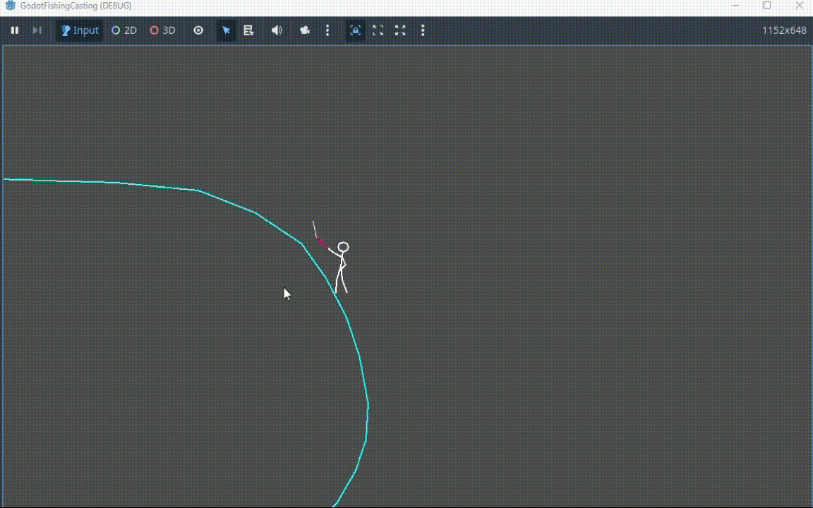

# Godot Fishing Casting

A smooth 2D fishing rod and line casting example in Godot.

**Keywords**: *parabola*, *Bezier curve*.

## Usage
* Left-click near the bottom-left area of the fishing rod to cast. The landing point of the fishing line is relative to the mouse cursor position.
* Press Esc to reset.
